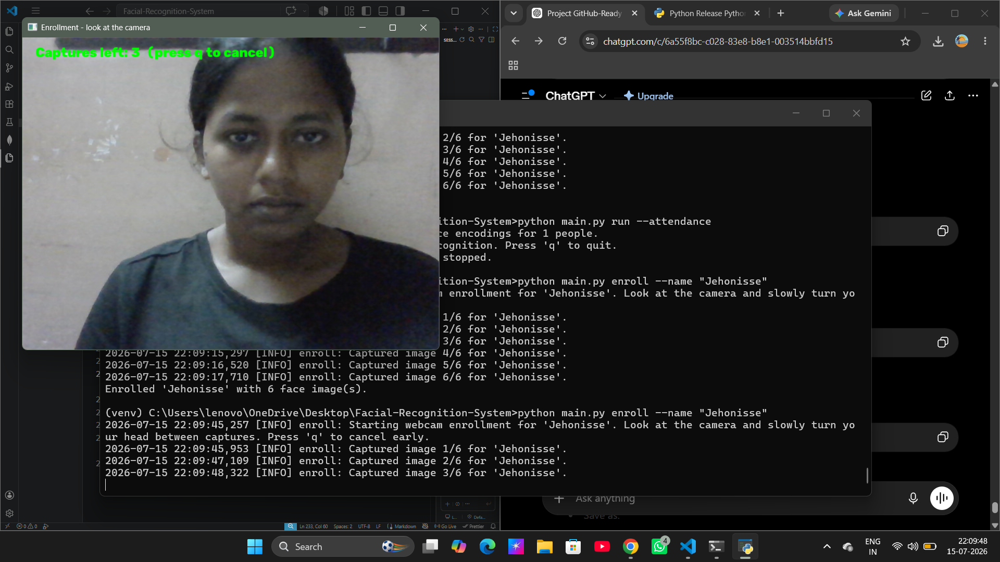
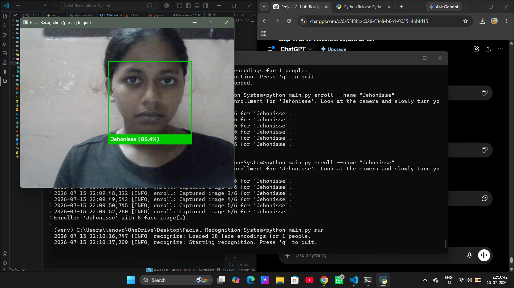
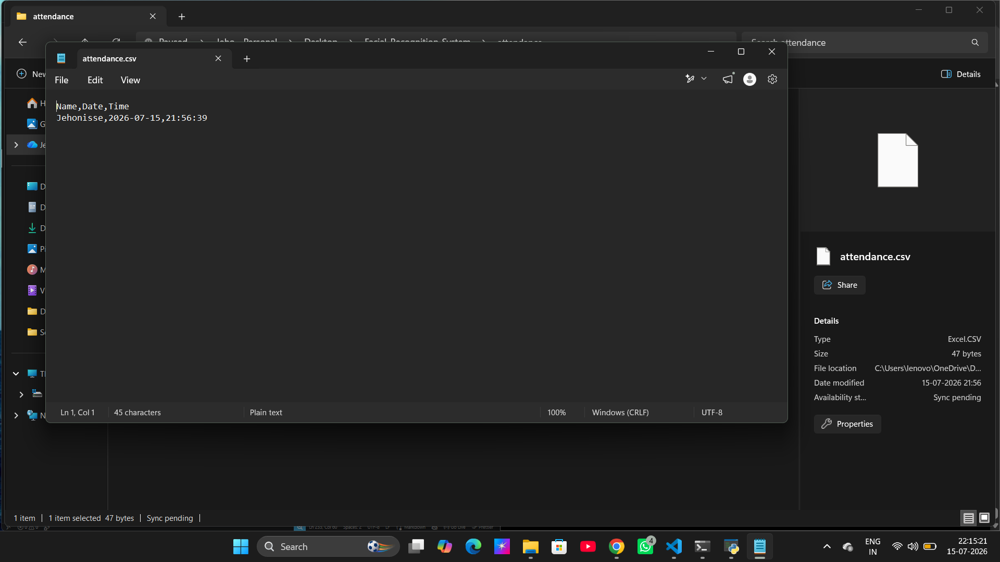
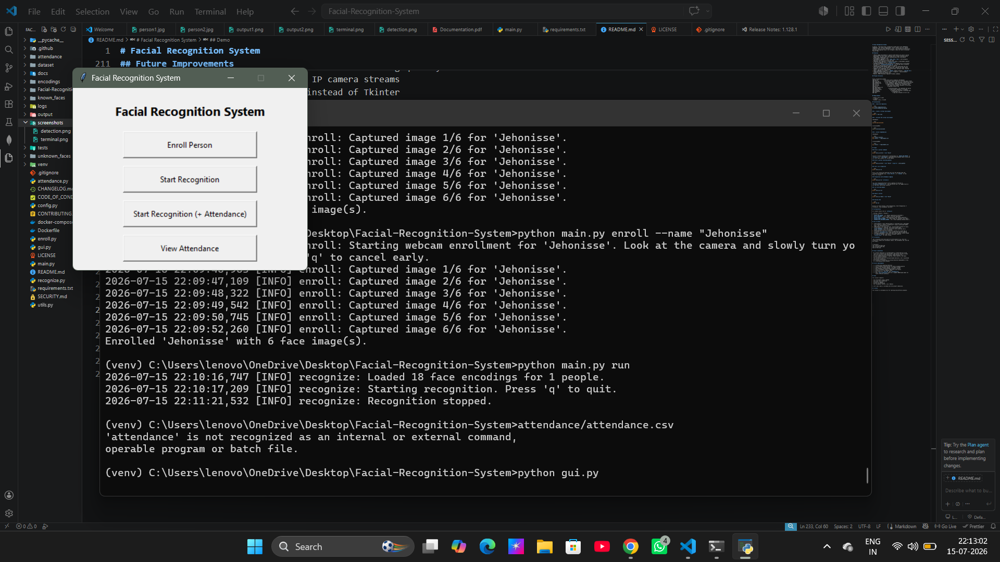

# Facial Recognition System


A modular, real-time facial recognition system built with **Python**,
**OpenCV**, and **face_recognition**. Enroll people from your webcam,
recognize them live with confidence scores, log attendance automatically,
and flag unrecognized faces — all through a clean CLI (with an optional
Tkinter GUI).

## Features

- **Multi-image enrollment** — captures 5–10 photos per person (varied
  pose/angle) for more robust matching than a single reference photo.
- **Real-time recognition** with bounding boxes and **confidence
  percentages** displayed live.
- **Attendance logging** to CSV (`Name, Date, Time`), with automatic
  duplicate prevention per person per day.
- **Unknown face capture** — automatically saves a timestamped snapshot
  of any unrecognized face to `unknown_faces/`.
- **Cached encodings** — face encodings are computed once at enrollment
  and stored in `encodings/encodings.pkl`, so the app starts instantly
  instead of reprocessing every photo on launch.
- **Performance-tuned webcam loop** — frames are downscaled and only
  every Nth frame is run through detection, keeping the video smooth.
- **Robust error handling** for missing faces, multiple faces, missing
  camera, and missing files/folders.
- **Full logging** via Python's `logging` module (console + `logs/app.log`).
- **Optional Tkinter GUI** for enroll / recognize / view-attendance
  without touching the command line.
- Modular, PEP8-formatted, beginner-friendly codebase.

## Project Structure

```
facial_recognition_system/
├── main.py           # CLI entry point (argparse subcommands)
├── enroll.py          # Enrollment: webcam capture or existing photo folder
├── recognize.py        # Live recognition loop, matching, unknown-face saving
├── attendance.py        # CSV attendance logging with duplicate prevention
├── utils.py              # Logging setup, encoding I/O, confidence math
├── config.py               # All paths and tunable constants in one place
├── gui.py                   # Optional Tkinter GUI
├── requirements.txt
├── known_faces/               # Enrolled photos, one subfolder per person
├── unknown_faces/               # Auto-saved snapshots of strangers
├── encodings/                     # Cached face encodings (encodings.pkl)
├── attendance/                      # attendance.csv
└── logs/                              # app.log (created on first run)
```

## Requirements

- Python 3.10 or later
- A webcam
- Windows, Linux, or macOS

## Installation

### 1. Clone the repository

```bash
git clone <repository-url>
cd Facial-Recognition-System
```

### 2. Create a virtual environment

```bash
python -m venv venv
```

### 3. Activate the virtual environment

**Windows**

```bash
venv\Scripts\activate
```

**Linux/macOS**

```bash
source venv/bin/activate
```

### 4. Install dependencies

**Windows**

```bash
pip install dlib-bin
pip install -r requirements.txt
```

**Linux/macOS**

```bash
pip install -r requirements.txt
```

## Usage

### Enroll a person (webcam)

```bash
python main.py enroll --name "Alice"
```

Captures 6 photos automatically (configurable via `IMAGES_PER_PERSON` in
`config.py` or `--num-images`), pausing briefly between shots so you can
turn your head slightly for varied angles.

### Enroll a person (existing photos)

```bash
python main.py enroll --name "Alice" --image-dir ./alice_photos
```

### Start live recognition

```bash
python main.py run
```

Draws a box around each detected face with the matched name and
confidence percentage (e.g. `Alice (92.4%)`), or `Unknown` in red.
Press `q` to quit.

### Recognition with attendance logging

```bash
python main.py run --attendance
```

Logs each recognized person's first sighting of the day to
`attendance/attendance.csv`. The same person won't be logged twice on
the same day, even across restarts.

### List enrolled people

```bash
python main.py list
```

### Remove a person

```bash
python main.py remove --name "Alice"
```

### Optional GUI

```bash
python gui.py
```

Buttons for Enroll Person, Start Recognition, Start Recognition (+
Attendance), View Attendance, and Exit.

## Configuration

All tunable values live in `config.py`:

| Setting | Default | Purpose |
|---|---|---|
| `IMAGES_PER_PERSON` | 6 | Photos captured per enrollment |
| `MATCH_THRESHOLD` | 0.6 | Lower = stricter matching |
| `RESIZE_SCALE` | 0.25 | Frame downscale factor before detection |
| `PROCESS_EVERY_N_FRAMES` | 2 | Skip frames for smoother live video |
| `UNKNOWN_SAVE_COOLDOWN_SECONDS` | 10 | Avoid spamming unknown_faces/ |

## How It Works

1. **Enrollment** — each captured photo is converted into a 128-number
   face encoding (a numeric "fingerprint") using a pretrained ResNet
   model, and stored per person.
2. **Matching** — for each live face, the Euclidean distance to every
   stored encoding is computed. The closest match under
   `MATCH_THRESHOLD` wins; the distance is also converted into a
   0–100% confidence score for display.
3. **Attendance** — the first match for a person on a given day is
   written to `attendance.csv`; later matches that day are ignored.
4. **Unknown handling** — faces that don't match anyone closely enough
   are labeled "Unknown" and (with a cooldown) saved to
   `unknown_faces/` for later review.

## Screenshots

### Enrollment


### Live Recognition


### Attendance Log


### GUI (Optional)



## Known Limitations

- No liveness detection — a printed photo or screen held up to the
  camera can currently fool the matcher. Real-world security systems
  need anti-spoofing (blink detection, depth sensing, etc.).
- Accuracy depends heavily on lighting, camera quality, and angle
  variety during enrollment.
- The confidence score is a distance-based heuristic, not a calibrated
  statistical probability.
- Not hardened for production or privacy-sensitive deployments — this
  is a learning/portfolio project.

## Future Improvements

- [ ] Liveness/anti-spoofing detection
- [ ] Face-alignment preprocessing for better encoding quality
- [ ] Support for multiple cameras / IP camera streams
- [ ] Web dashboard (Flask/FastAPI) instead of Tkinter
- [ ] Export attendance reports (PDF/Excel) with charts
- [ ] Dockerfile for one-command setup
- [ ] Unit tests for `utils.py` and `attendance.py`
- [ ] Swap `face_recognition`/dlib for a lighter ONNX-based model for
      faster CPU-only inference

## Demo

This project supports:

- Face enrollment using a webcam
- Real-time face recognition
- Attendance logging
- Unknown face detection
- User management (Enroll, List, Remove)

A short demo video is included with the project submission.

## Internship Information

This project was developed and submitted as part of my Python Internship.

**Intern ID:** CITS4415 
**Intern Name:** Jehonisse Jerripothula  
**Domain:** Python Development  
**Organization:** CodTech IT Solutions  
**Duration:** June 2026 – July 2026

## License

This project is provided as-is for learning and portfolio purposes.
